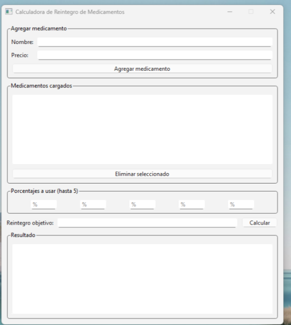

<h1>Bienvenidos a mi perfil</h1>
 

 
<h1>Soy Guillermo.</h1>
 
<h3>
Soy estudiante de la UTN de San Rafael y del Cfp 6 en Caba. Desde el año 2023 estoy incursionando en el mundo IT, aprendiendo mis primeros lenguajes de programación.
  
Actualmente me encuentro estudiando redes, programación, ciberseguridad y realizo trabajos como pasante en una empresa desarrollando pequeñas herramientas de trabajo, realizadas en python con pyside6 y django que dejaré aqui abajo.
  
Caluladora de reintegros:
 

  
Caluladora de prestamos:
 

  
Gestor de inventario:
 

</h3>
  

## 🌐 Socials:
  

# 💻 Tech Stack:
       
# 📊 GitHub Stats:
 
 

### 🔝 Top Contributed Repo

<!-- Proudly created with GPRM ( https://gprm.itsvg.in ) -->
